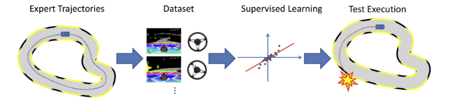

# Creating-an-Autonomous-Car-Using-Deep-Learning-with-Python
Complete Guide to Self-Driving Car with Udacity's Car Simulator Environment and Deep Neural Networks
### Understanding Behavioral Cloning

Behavioral cloning is a technique used in autonomous vehicle systems. In this approach, instances where a human or an expert takes control of the vehicle and guides it to perform a specific task are recorded. Later, these recorded data are used to train an artificial intelligence model. This model attempts to mimic the movements and decisions made by the human or expert. As a result, autonomous vehicles can exhibit human-like behaviors and accomplish specific tasks using this model.

  
  
<em>Imitation Learning</em>

### Driving Simulator: Udacity
Udacity's autonomous vehicle simulator offers students the opportunity to develop autonomous vehicle software. It provides an environment that mimics real-world scenarios, allowing students to practice, debug, and enhance their skills. This simulator provides students with real-world experience while reducing costs and risks.

The simulator includes two tracks. One is considered simple, while the other is more complex. Here, "simple" implies tracks with fewer curves and easier driving. The simulator has two modes for driving: (1) Training mode and (2) Autonomous mode. The Training mode offers the option to record your driving and capture training datasets.
